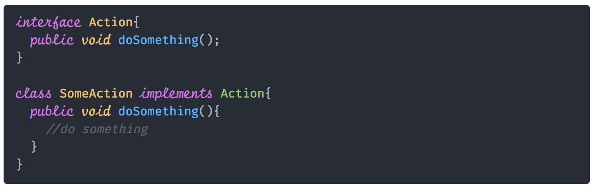

# Personalize

A mini repo to quickly set up a new mac with my preferred settings.

Configuration repo contains the following information.

* Dependencies not handled by brew
* Customizations like plugins and themes
* Post-install steps
  * shell completions
  * environment and path variables
* Shareable configurations
* Select apps using categories or search and build your own set.
* Recommended apps/optional configurations

Example:
  * prezto v/s oh-my-zsh
  * Node Developer
  * Java Developer
  * Cloud Operations
  *

### Basics

* commandline tools
* ZSH using oh-my-zsh
* homebrew

Languages and packages

* Terminal & ZSH theme
* Brew packages
* Python packages
* R packages
* Node libraries

## Atom Editor

Preview of the editor using the fonts [Fira Code](https://github.com/tonsky/FiraCode) and [Script 12 BT](https://www.wfonts.com/font/script12-bt)


Minimal set of atom plugins

* markdown preview
* markdown pdf
* data atom
* hydrogen

### Usage

```bash
 git clone https://github.com/jerrythomas/personalize

 cd personalize

 . ./brew.zsh
 . ./node.zsh
 . ./java.zsh

 cd atom & . ./atom.zsh
 cd ../cloud & brew bundle install
 cd ../data & brew bundle install
 cd ../r4ds & . ./r4ds.zsh
 cd ../py4ds & . ./python3.zsh
 cd ../flutter & brew install ./flutter.rb
 cd ..

```

How can I make it easier to configure and set up a mac machine quickly?

A configuration UI to select the apps, libraries, fonts that need to be installed, customizations etc.

Customizations:
  * prezto
  * zsh command prompt
  * terminal colors
  * syntax themes for vim, atom, other editors

Apps and cli. Anything that is available on homebrew.

Generate a yaml/json config file and push it to their github gist or any other publicly accessible url.
commandline pull the config and setup the system.

addon - custom scripts to extend.
